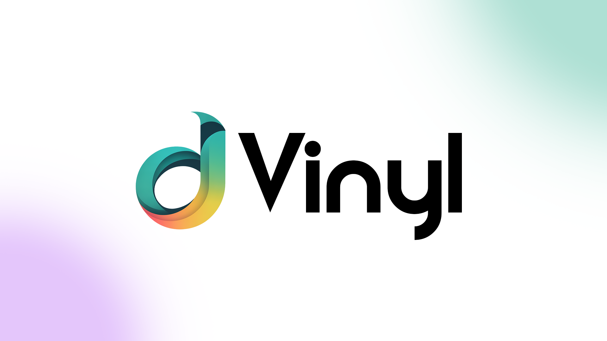
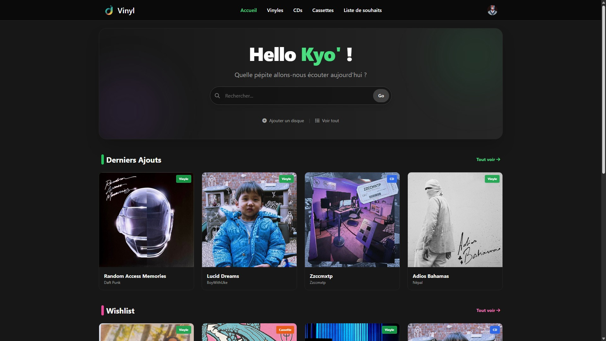
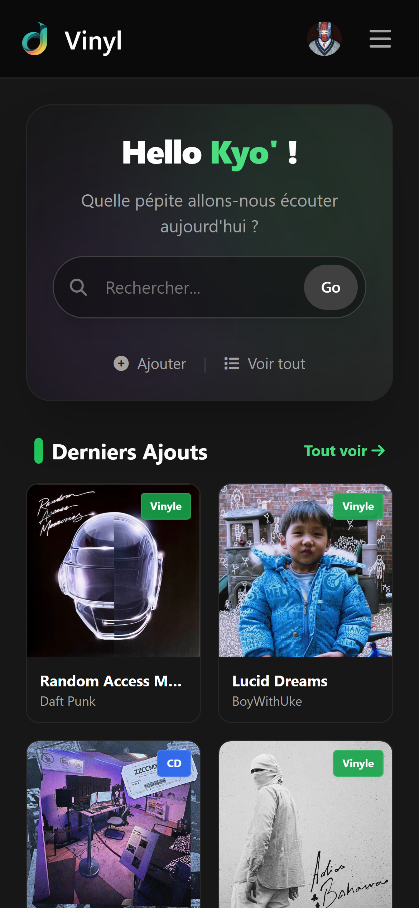
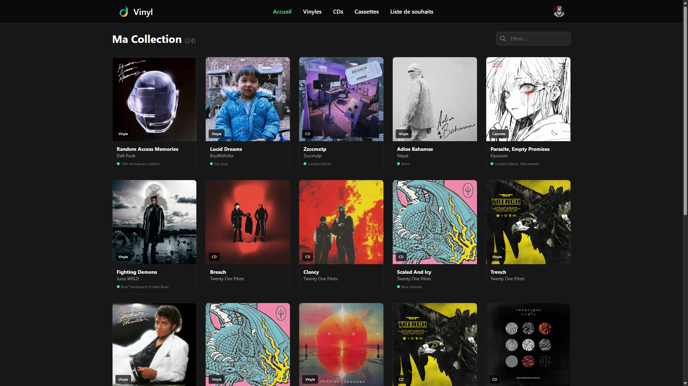
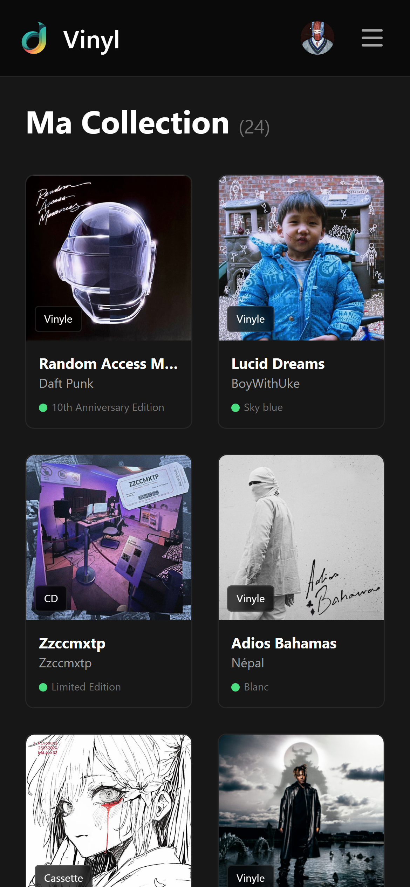
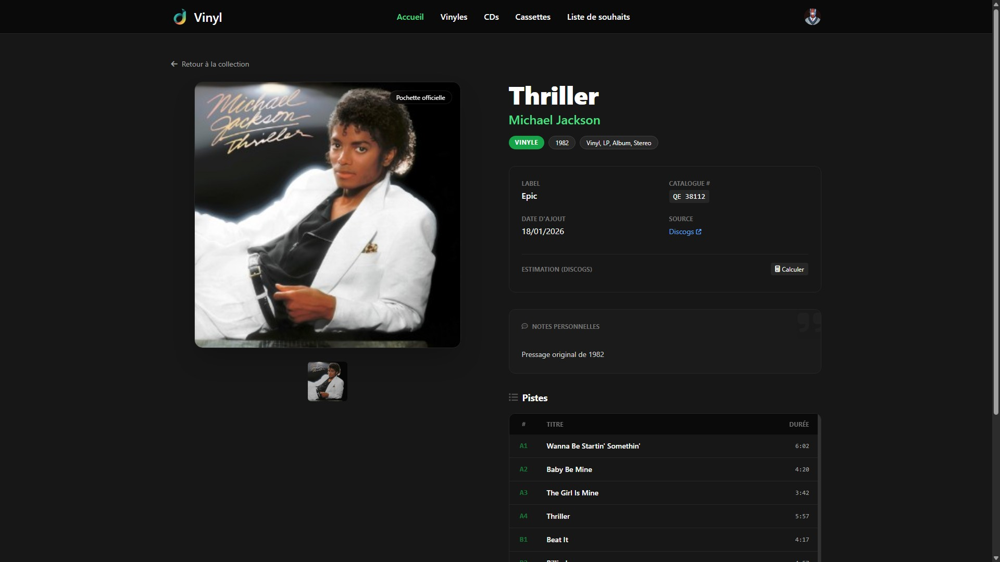
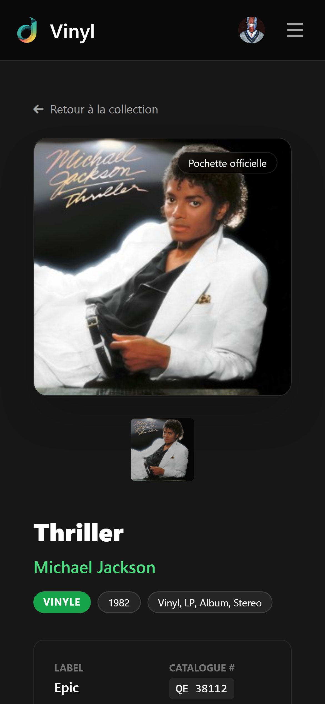

--- 

**DVinyl** is a modern, self-hostable music collection manager. It allows you to catalog, value, and manage your Vinyls, CDs, and Cassettes in one interface.

Built in JavaScript.

[](https://opensource.org/licenses/MIT)
[](#)
[](#)


## Overview

DVinyl allows you to keep track of your physical music collection. It uses the Discogs API to retrieve important metadata and market valuations for your collection. This provides you with a convenient dashboard for your home server.

### ✨ Key Features

* Manage Vinyls, CDs, and Cassettes in a unified library.
* Instant import using Discogs Release IDs.
* Scan your physical media to easily add it to your digital collection*
* Get market estimates (Low/Median/High) for your entire collection.
* Whishlist system.
* Fully localized in English 🇬🇧 and French 🇫🇷.
* Optimized for mobile management with native Dark & Light modes.
* Authentication system for people who want to see your collection.

*<small>(may only work in France)</small>

## Documentation

To keep things organized, I have split the documentation into specialized guides:

* 🏁 [**Getting Started**](./docs/getting-started.md) - Manual installation and requirements.
* 🐳 [**Docker Deployment**](./docs/docker.md) - Deploying via Docker Compose *(Recommended)*.
* 🔑 [**API Configuration**](./docs/api-keys.md) - How to obtain your Discogs and Google API keys.

---

## Quick Start (Docker)

If you have Docker and Docker Compose installed, run the following:

```bash
# Clone the repository
git clone [https://github.com/Kyonew/DVinyl.git](https://github.com/Kyonew/DVinyl.git)
cd dvinyl

# Setup environment variables
cp .env.example .env

# Start the containers
docker-compose up -d
```

Access the application at `http://localhost:3099`.

# Tech stack

| **Component**    | **Technology**                 |
| :--------------- | :----------------------------- |
| **Backend**      | Node.js / Express              |
| **Database**     | MongoDB                        |
| **Frontend**     | EJS Templates                  |
| **Styling**      | Tailwind CSS                   |
| **Localization** | i18next                        |
| **API**          | Discogs / Google Custom Search |

# Screenshots

| 🖥️ Desktop View | 📱 Mobile View |
|-----------------|----------------|
|  |  |
| [](./docs/img/desktop-collection.jpg) | [](./docs/img/mobile-collection.png) |
| [](./docs/img/desktop-detail.jpg) | [](./docs/img/mobile-detail.png) |


# 🤝 Contributing

Honestly, this is my first app of this kind. I am open to any help and advice for this app and my future ones!

If you want to help, you can:

1. Fork the project.
2. Create your Feature Branch (`git checkout -b feature/AmazingFeature`).
3. Commit your changes (`git commit -m 'Add some AmazingFeature'`).
4. Push to the branch (`git push origin feature/AmazingFeature`).
5. Open a Pull Request.

# 📄 License

Distributed under the MIT License. See `LICENSE` for more information.

<br>

> [!IMPORTANT]
>
> Please note that parts of the frontend and docstrings were generated with the assistance of AI tools. While I reviewed and corrected the output where necessary, this project is not 100% human-made.
>
> Your feedback is highly appreciated, even for the backend, where I may have made significant errors. I would be grateful for any suggestions or comments to improve the project.
>
> Thank you for your understanding <3